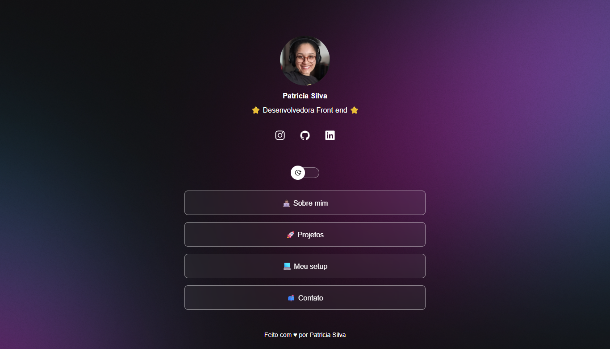

<h1 align="center">🌐 Patricia Silva - Página de Links</h1>

<p align="center">
  Página pessoal com links rápidos e interface responsiva, feita com <strong>HTML</strong>, <strong>CSS</strong> e <strong>JavaScript</strong> 💻.
  <br>
  <br>
  <a href="https://patriciasilvadev.github.io/" target="_blank">🔗 Acesse aqui</a>
</p>

<p align="center">
  
  
  
  
</p>

---

## 🖼️ Preview

<div align="center">
  
</div>

---

## 📌 Sobre o projeto

Este projeto foi desenvolvido durante o curso **Discover** da [Rocketseat](https://www.rocketseat.com.br/), que ensina os fundamentos do desenvolvimento web, desde a base até aplicações completas.

A ideia é criar uma página simples e funcional, que reúna:

- Redes sociais
- Links para seções como portfólio, setup e contato
- Um layout bonito e responsivo com modo escuro 🌙

---

## ✨ Funcionalidades

✅ Interface responsiva  
✅ Alternância entre modo claro/escuro  
✅ Ícones sociais com links externos  
✅ Navegação simples com botões estilizados  
✅ Organização em seções: Sobre, Projetos, Setup e Contato

---

## 🛠️ Tecnologias usadas

- HTML5
- CSS3
- JavaScript
- [Font Awesome](https://fontawesome.com/)
- Figma (referência de design)

---

## 🧠 Aprendizados

Durante o desenvolvimento, aprendi:

- Estrutura semântica do HTML
- Flexbox e alinhamentos no CSS
- Criação de temas (modo escuro)
- Manipulação de DOM com JavaScript
- Boas práticas de organização e acessibilidade

---

## 📸 Créditos da foto

> A imagem de perfil utilizada é de minha autoria.

---

## 🚀 Como rodar localmente

```bash
git clone https://github.com/patriciasilvadev/patriciasilvadev.github.io
```
cd patriciasilvadev.github.io
abra o arquivo index.html no navegador

## 💌 Contato
Se quiser trocar uma ideia, me chama:

- Instagram: @patriciasilvadev.io
- LinkedIn: Patrícia Silva Dev
- GitHub: patriciasilvadev

<p align="center">Feito com 🩷 por <strong>Patrícia Silva</strong></p> ```
